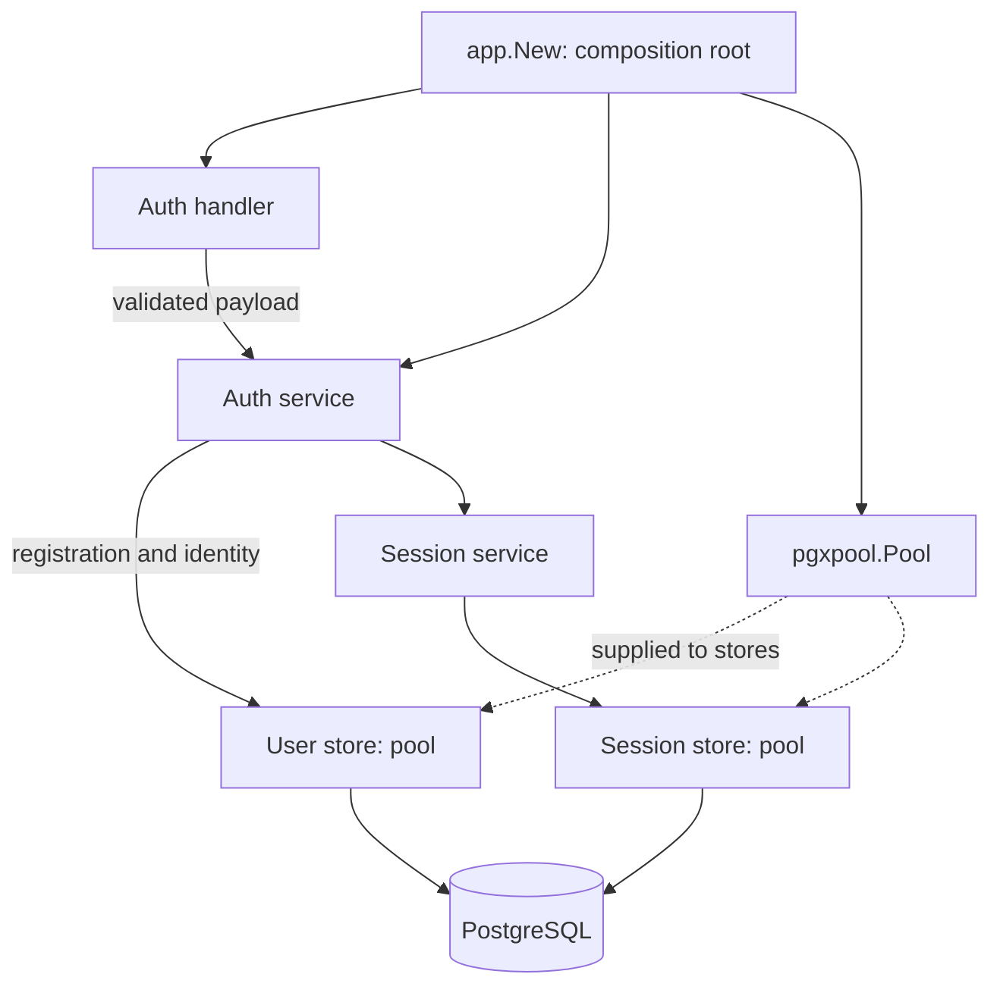

# Backend Architecture Guidelines

**Pattern:** Handler → Service → Store (Controller-Service-Repository)
**Stack:** Go, PostgreSQL, pgx; parameterized SQL, no ORM or query builder.

## Platform

Auth, account, and application middleware use `platform/httpx`, `platform/middleware`, and `platform/validator`:

- HTTP handlers use standard `http.Handler` signatures, shared decoding and response helpers, and a module-local error mapper instead of `httpx.Adapt`.
- Domain sentinels live beside their modules. Stores wrap them with `%w`; services preserve errors without converting them to HTTP errors. Auth preserves credential and missing-user causes with `errors.Join`.
- DTO validation normalizes inputs and returns `validator.ErrorValidation`, with messages keyed by JSON field name. Store defensive validation preserves this structured error. The validator is configured once and reused concurrently.
- Handlers map invalid IDs/fields to 400, missing accounts/owners to 404, malformed JSON to 400, oversized bodies to 413, and unexpected errors to a logged, generic 500. Errors use `application/problem+json`; success uses `data` and an optional `message`.
- The application resolves sessions with `GetUserFromSession`; auth and account guards read the same verified user ID context. Rate-limit, recovery, and session-lookup failures use problem details; Go's cross-origin protection still writes plain-text 403 rejections.
- Existing PostgreSQL helpers, SQL, ownership predicates, and account-creation transaction locking remain unchanged. The migration does not relocate transaction ownership.

See [OpenAPI](../api/openapi.yaml) for the response contract.

## 1. Layer Responsibilities

| Layer | Owns | Must not contain |
| --- | --- | --- |
| **Handler** | HTTP routing, decoding, payload validation, status codes, JSON responses | Business workflows, SQL, transactions |
| **Service** | Business rules, workflow orchestration, transaction boundaries | HTTP details, SQL |
| **Store** | Parameterized queries, row scanning, persistence error translation | Business workflows, HTTP details, transaction ownership |
| **PostgreSQL platform** | Pool setup and transaction lifecycle through `postgres.InTx` | Domain rules, application queries |

### Handlers

- Decode and validate request payloads before calling a service.
- Handle errors before writing a response; register standard `http.Handler` functions.
- Use a module-local mapper to translate domain errors into statuses, log unexpected errors, and write safe problem-detail responses.

### Services

- Enforce business rules and coordinate stores.
- Decide which operations must succeed or fail together.
- Use `postgres.InTx` with a pool for atomic workflows; construct participating stores with the callback's `pgx.Tx`.
- Keep expensive work that does not need a transaction, such as password hashing, outside it.
- Return safe domain models or DTOs; never expose password hashes.
- Return domain errors, preserving original causes with `%w` or `errors.Join`. Propagate unexpected errors with useful context.

### Stores

- Accept `postgres.DBTX`, which both `*pgxpool.Pool` and `pgx.Tx` satisfy.
- Execute queries through the supplied dependency. The same store works inside or outside a transaction.
- Translate recognized persistence errors into domain errors, such as `user.ErrEmailTaken` or `user.ErrNotFound`.
- Wrap unexpected errors with operation context using `%w`.
- Do not begin transactions or construct other stores.

## 2. Dependencies and Wiring

`internal/app/app.go` is the composition root. Wire dependencies explicitly with constructors; no IoC container is required.

### Platform packages

```text
internal/platform/
├── httpx/                    # JSON decoding, responses, and HTTP errors
├── middleware/               # Chaining, recovery, logging, CORS, auth, rate limiting
├── postgres/                 # Connection pool, DBTX, and transaction lifecycle
├── redis/                    # Redis connection setup
├── logger/                   # Logger setup
└── validator/                # Validation configuration and structured field errors
```

Platform packages must not import `internal/modules`. Authentication middleware accepts a user-ID lookup function; `app.New` adapts the session service, translating missing or expired sessions into an empty user ID with no error. Other lookup errors remain errors and produce a generic `500` response. User-context helpers live beside authentication middleware.

### Wiring

- **Handlers** receive services and supporting infrastructure such as a logger.
- **Services** receive stores and collaborating services through consumer-defined interfaces. Construct pool-backed stores in `app.New`; additionally inject a pool when a service owns transactional workflows. Transaction-bound stores are constructed inside the transaction callback.
- **Stores** receive `postgres.DBTX`.
- Services may depend on other services for shared business logic, but dependencies must remain acyclic. Extract shared logic when needed.


```mermaid
flowchart TD
    App["app.New: composition root"] --> Handler["Auth handler"]
    App --> Service["Auth service"]
    App --> Pool["pgxpool.Pool"]
    Handler -->|"validated payload"| Service
    Service -->|"registration and identity"| UserStore["User store: pool"]
    Service --> SessionService["Session service"]
    SessionService --> SessionStore["Session store: pool"]
    Pool -.->|"supplied to stores"| UserStore
    Pool -.-> SessionStore
    UserStore --> DB[(PostgreSQL)]
    SessionStore --> DB
```

## 3. Transaction Ownership

**The service owns the boundary; `postgres.InTx` manages the lifecycle.**

- `DBTX` exposes only `Exec`, `Query`, and `QueryRow`; it does not expose `Begin`.
- `InTx` accepts a `*pgxpool.Pool`, begins a transaction, and passes `pgx.Tx` to the callback.
- A nil callback error triggers commit. A callback error is returned and triggers deferred rollback.
- Deferred rollback also runs during panic unwinding and uses a context without request cancellation so cleanup can proceed.
- Begin and commit failures are returned with operation context.
- This helper does not support nested transactions. Pass the existing transaction to participating stores instead.
- Inside the callback, use transaction-backed stores for all participating writes. Using a pool-backed store would put those writes outside the transaction.

### Example: Registration

`AuthService.Register` checks email availability, hashes the password, and calls the user store to insert the user and required password hash together. A single `INSERT` is atomic, so registration needs no explicit transaction or pool dependency. The password field is excluded from JSON with `json:"-"`.

```mermaid
sequenceDiagram
    participant H as Auth handler
    participant S as Auth service
    participant U as User store
    participant DB as PostgreSQL

    H->>S: Register(ctx, payload)
    S->>U: FindByEmail (pool)
    U->>DB: SELECT user
    DB-->>U: Result
    U-->>S: User or error
    Note over S: Reject existing email or unexpected error; otherwise hash password
    S->>U: Create(name, email, passwordHash)
    U->>DB: INSERT user with password hash
    DB-->>U: User or error
    U-->>S: User or error
    S-->>H: User or error
```

A rejected password write must leave no user behind. The email pre-check is only an early response: the database unique constraint remains authoritative when registrations race.

## 4. Validation and Errors

| Layer | Validates | Failure handling |
| --- | --- | --- |
| **Handler** | JSON shape, required fields, lengths, basic formats | Return `400 Bad Request` |
| **Service** | Business rules, permissions, application state | Return domain errors preserving causes |
| **Store / database** | Unique keys, foreign keys, not-null and other integrity constraints | Translate known violations; wrap unexpected failures |

DTO validation returns `validator.ErrorValidation`, containing messages keyed by JSON field name. Modules configure `go-playground/validator/v10` once with `UseJSONName` and use `FormatErrors`; only the first failed rule per field is reported. Email follows the built-in `email` rule. Auth trims names and email addresses, rejects whitespace-only passwords using a validation copy, enforces a minimum of 8 characters and bcrypt's maximum of 72 bytes, and never modifies the actual password. Account-store defensive validation preserves structured errors with `%w`.

`httpx.DecodeJSON` accepts exactly one JSON object with no unknown fields and enforces a 1 MiB limit over the complete body, including trailing data. It returns client-safe `HTTPError` values for invalid bodies (`400`) and oversized bodies (`413`). Handlers map these and validation errors into problem details, with `errors` included only for validation. Do not echo submitted values or internal causes; clients should use statuses and field keys rather than parse human-readable messages.

Errors travel upward through normal Go returns, not exceptions:

1. The store translates recognized database failures into domain errors.
2. Domain sentinels stay beside their domains. Services preserve expected failures and unexpected causes; `errors.Is` and `errors.As` continue to work.
3. Module-local handler mappers translate known errors to statuses: auth email conflicts become 409, invalid credentials or missing identity become 401. Unexpected failures are logged and become generic 500 responses; underlying causes never enter JSON.

HTTP status codes belong only to the transport. Handlers use `SendSuccess` and `SendError` and log write failures without attempting to replace an already-committed response.

Data flows upward as **database rows → store models → service results → handler JSON**. Keep sensitive persistence fields out of public responses.

## 5. Verification

Follow the [testing guidelines](testing_guideline.md) for coverage responsibilities, case limits, naming, assertions, isolation, and review rules.

- **Unit tests** exercise dependency-free validation/parsing and distinct middleware contracts using standard `testing` and `httptest`. Small handwritten stubs are reserved for difficult-to-trigger failures; middleware lookup callbacks may verify forwarding/context and downstream execution.
- **Integration tests** use `//go:build integration`, real services/stores, and PostgreSQL for ordinary auth/session outcomes, hashing, persistence, expiry, rollback, and HTTP response/cookie contracts. Tests through `app.New` prove representative wiring and a complete lifecycle, without repeating lower-level matrices or storage assertions. Each behavioral contract has one primary owner; domain errors and their HTTP mapping are distinct contracts. Do not change production interfaces solely for testing.
- **Database isolation** uses `internal/testutil.Postgres`: explicit `.env.test`, real Goose migrations, one private schema per test, schema-only `search_path`, and schema-scoped cleanup. Setup failures are fatal, not skipped.

See [tests and checks](../README.md#tests-and-checks) for local setup and commands.
